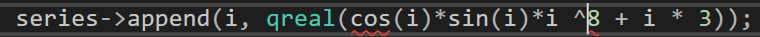

1. 表达式必须具有整数或未区分范围的枚举类型    

   

   错误原因：^  是按位异或运算符   (参与运算的两个值，如果两个相应bit位相同，则结果为0，否则为1。)

2. ```c++
   chart->setTitle(QString::fromLocal8Bit("中文")); // 设置图表的标题
   //由于chart库编码不是utf8故需要用此方法防止乱码
   ```

3. ```
   #include "ui_SXWidget.h"   //中间要有空格，否则编译不出来
   ```

4. error C2143: 语法错误 : 缺少“;”(在“类型”的前面)      检查include关系有没有问题

c++类  函数引用自身其他函数

