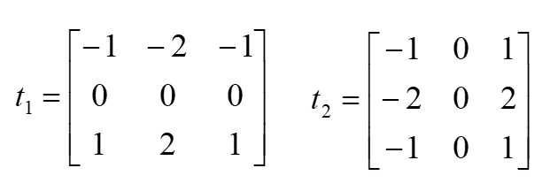
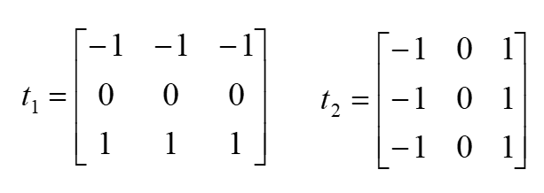

# 基础

## 编程tip

1. 能用向量不用循环

   ```matlab
   i=1:100;
   mat=mat.*15;
   ```

   

2. BIL和BIP运算效率高  ，BSQ读取效率高

3. 数组下标是**从1开始**的！！！！！！！

4. Ctrl+C  强制退出运行

5. 像素处理一定将   **uint8转换为double**  

   ```
   double(img);   
   img1=im2double(img);
   ```

6. 尽量少的用中间参数，减少空间复杂度。有些参数是最后不用的，直接覆盖

   

   

## 文件读写

### 文件读取

```matlab
f_id=fopen('filename','r');
num=fread(f_id,[m,n],'int8');   
fclose(f_id);
```

### 文件存储

```matlab
f_id=fopen('filenmae','a');
fwrite(f_id,num,'int8');
fclose(f_id);
```

| r    | 行读操作（默打开文件进认形式）                               |
| ---- | ------------------------------------------------------------ |
| r+   | 打开文件进行**读和写**操作                                   |
| w    | 删除已存在文件中的内容或生成一个新文件，打开进行写操作       |
| w+   | 删除已存在文件中的内容或生成一个新文件，打开进行读和写操作   |
| a    | 生成并打开一个新文件或打开一个已存在的文件，进行写操作，在文件末尾追加 |
| a+   | 生成并打开一个新文件或打开一个已存在的文件，进行读和写操作，在文件末尾追加 |

若在上表的字符后加 “b” ，则表示以二进制进行操作。

### MAT文件读取

```
load('filename');
```

### 图像读取

imread

```matlab
[A,map]=imread(filename,fmt)；%%将图像文件filename中的数据读入矩阵A中。
%%map：为彩色图像的调色板，它的值归一化到[0,1]
%fmt：指定了图像的格式
```

imwrite

```matlab
imwrite(A,map,filename,fmt);
```

image与imshow

```matlab
image(x);colormap(map);  %%colormap 是调色板

imshow(I);
```


## 随机数

```matlab
M = magic(3) 
%生成一个n*n的矩阵，矩阵元素是由整数1到n^2组成的并且任何行任何列的和都相等，阶数n必须是大于等于3的标量。
M =
8 1 6
3 5 7
4 9 2 
```

## reshape

```matlab
B = reshape(A,m,n)  %将矩阵A的元素返回到一个m×n的矩阵B。如果A中没有m×n个元素则返回一个错误。
B=reshape(A,2,[])   %结果为两行
```

## sprintf

将数据格式化为字符串

| 值类型       |                             转换                             | 详细信息                                         |
| :----------- | :----------------------------------------------------------: | :----------------------------------------------- |
| 有符号整数   |                         `%d` 或 `%i`                         | 以 10 为基数                                     |
| 无符号整数   |                             `%u`                             | 以 10 为基数                                     |
| `%o`         |                    以 8 为基数（八进制）                     |                                                  |
| `%x`         |          以 16 为基数（十六进制），小写字母 `a`–`f`          |                                                  |
| `%X`         |                与 `%x` 相同，大写字母 `A`–`F`                |                                                  |
| 浮点数       |                             `%f`                             | 定点记数法（使用精度操作符指定小数点后的位数。） |
| `%e`         | 指数记数法，例如 `3.141593e+00`（使用精度操作符指定小数点后的位数）。 |                                                  |
| `%E`         | 与 `%e` 相同，但为大写，例如 `3.141593E+00`（使用精度操作符指定小数点后的位数）。 |                                                  |
| `%g`         | 更紧凑的 `%e` 或 `%f`，不带尾随零（使用精度操作符指定有效数字位数。） |                                                  |
| `%G`         | 更紧凑的 `%E` 或 `%f`，不带尾随零（使用精度操作符指定有效数字位数。） |                                                  |
| 字符或字符串 |                             `%c`                             | 单个字符                                         |
| `%s`         | 字符向量或字符串数组。输出文本的类型与 `formatSpec` 的类型相同。 |                                                  |

```matlab
formatSpec = "The current time is: %d:%d %s";
A1 = 11;
A2 = 20;
A3 = 'a.m.';
str = sprintf(formatSpec,A1,A2,A3)
```

```
str = 
"The current time is: 11:20 a.m."
```

```matlab
str = sprintf('%d',round(pi))   %   str='3'
```

# 遥感数字图像处理入门

## 图像统计

### 直方图和累计直方图

```matlab
function LjorZft = ZhiFangTu_(image)
[rows,cols,bands]=size(image);
ljzft=zeros(bands+1,256)  %累计直方图每个波段一行，一行256列
ljzft(1,:)=0:255;
zft=ljzft;
%% 直方图
for band = 1:bands
	oneband=image(:,:,band);
	oneband=double(oneband(:));
	for i = 1:rows*cols
		value=oneband(i);
		zft(band+1,value+1)=zft(band+1,value+1)+1;
	end
end
%% 累计直方图
for band = 1:bands
	%对于累计直方图 第一个值是直方图的值，之后在前一个基础上加即可
	ljzft(band+1,1)=zft(band+1,1);
	for i = 2:256
		ljzft(band+1,i)=ljzft(band+1,i-1)+zft(band+1,i);
	end
end
LjorZft.ljzft=ljzft;
LjorZft.zft=zft;
end
```

### 统计值

```matlab
function st = statics(image)
[rows,cols,bands]=size(image);
%% 均值
average=zeros(1,bands);
for band =1:bands
    OneBand = image(:,:,band);
    OneBand=double(OneBand(:));
    for i = 1:rows*cols
        average(band)=average(band)+OneBand(i);
    end
    average(band)=average(band)/rows/cols;
end

%% 中值
midvalue=zeros(1,bands);
for band =1:bands
	oneband = image(:,:,band);
	oneband=double(oneband(:));
	for i =1:rows*cols
		for j = 1:rows*cols-1
			if oneband(j)>oneband(j+1)
				tp=oneband(j+1);
				oneband(j+1)=oneband(j);
				oneband(j)=tp;
			end
		end
	end
	midvalue(band)=oneband(round(rows*cols/2));
end

%% 众数
mode=zeros(1,bands);
zft=zeros(1,256);
for band = 1:bands
	oneband=image(:,:,band);
	oneband=double(oneband(:));
	for i = 1:rows*cols
		gray=oneband(i);
		zft(gray+1)=zft(gray+1)+1;
	end
	nummax=zft(1);maxindex=1;
	for i = 1:256
		if zft(i)>nummax
			nummax=zft(i);
			maxindex=i;
		end
	end
	mode(band)=maxindex-1;
end 

%% 方差
vars=zeros(bands,bands);
for iband = 1:bands
	ioneband=image(:,:,iband);
	ioneband=double(ioneband(:));
	for jband = 1:bands
		joneband=image(:,:,jband);
		joneband=double(joneband(:));
		re=0;
		for i =1:rows*cols
			re=re+(ioneband(i)-average(iband))*(joneband(i)-average(jband));
		end
		vars(iband,jband)=re/rows/cols;
	end
end

%% 相关系数
rou=zeros(bands,bands);
for i = 1:bands
	for j = 1:bands
		rou(i,j)=vars(i,j)/sqrt(vars(i,i)*vars(j,j));
	end
end
%% 结构赋值
st.average=average;
st.midvalue=midvalue;
st.mode=mode;
st.vars=vars;
st.rou=rou;

end
```

## 图像处理

### 线性拉伸

```matlab
function xxls =  Xianxinglashen_(image,backmin,backmax)
[rows,cols,bands]=size(image);
for band = 1:bands
	oneband=image(:,:,band);
	oneband=double(oneband(:));
	maxnum=-1;minnum=1000;
	% 找出最大最小值
    images=image;
	for i =1:rows*cols
		if oneband(i)>maxnum
			maxnum=oneband(i);
		end
		if oneband(i)<minnum
			minnum=oneband(i);
        end
    end
	oneband = (backmax-backmin)/(maxnum-minnum)*(oneband-minnum)+backmin;
	images(:,:,band)=reshape(oneband,rows,cols);
end
xxls=images;
end
```

### 直方图均衡化

```matlab
function jhhimage = Junhenghua_(image)
[rows,cols,bands] = size(image);
for band = 1:bands
	oneband=image(:,:,band);
	oneband=double(oneband(:));
	myzft=ZhiFangTu_(oneband);
	bhh=myzft.ljzft(2,:)*255/rows/cols;
	bhh=round(bhh);
	oneband=bhh(oneband+1);  %%%%%这句非常快，但比较难想
	image(:,:,band)=reshape(oneband,rows,cols);
end
jhhimage=image;
```

### 直方图匹配

```matlab
function ppimage = PiPei_(bimage,cimage)
[rowb,colb,bandsb]=size(bimage);
[rowc,colc,bandsc]=size(cimage);
for band =1:bandsc
    onebandb=bimage(:,:,band);
    onebandb=onebandb(:);
    zftsb=ZhiFangTu_(onebandb);
    onebandc=cimage(:,:,band);
    onebandc=onebandc(:);
    zftsc=ZhiFangTu_(onebandc);
    sumb=zftsb.ljzft(2,:)/(rowb*colb);
    sumc=zftsc.ljzft(2,:)/(rowc*colc);
    match=zeros(1,256);
    for i = 1:256
    	mindist=5;   % 本来就小于1
    	index=-1;
    	for j = 1:256
    		if abs(sumc(i)-sumb(j))<mindist
    			mindist=abs(sumc(i)-sumb(j));
    			index=j;
    		end
    	end
    	match(i)=index-1;
    end
    onebandc=match(onebandc+1);
    cimage(:,:,band)=reshape(onebandc,rowc,colc);
end
ppimage=cimage;
```

## 图像滤波与图像锐化

### 中值滤波

```matlab
function  mlb= MidLB(image,n)
%   image  n为窗口大小
[rows,cols]=size(image);
mlb=image;
jian=(n-1)/2; %自适应窗口，减去某值
for row = 2:rows-1
    for col = 2:cols-1
        list=image(row-jian:row+jian,col-jian:col+jian);
        list=list(:);
        list=sort(list);
        mid=list(floor(n*n/2));
        mlb(row,col)=mid;        
    end
end
end
```

### 均值滤波

```matlab
function meanlb = MeanLB(image,n)
%image为一个灰度图
%   此处显示详细说明
meanlb=image;
[rows,cols]=size(image);
jian=(n-1)/2;
for row = 2:rows-1
    for col = 2: cols-1
        list=image(row-jian:row+jian,col-jian:col+jian);
        list=double(list(:));
        average=mean(list);
        meanlb(row,col)=average;
    end
end
end
```

### Sobel锐化

算子：



```matlab
function sbl = Sobel(image)
%SOBEL image为一个灰度图
%   此处显示详细说明
[rows,cols]=size(image);
sbl=zeros(rows,cols);
for row = 2:rows-1
    for col = 2:cols-1
        list=image(row-1:row+1,col-1:col+1);
        list=double(list);
        x=list(3,1)+list(3,3)+list(3,2)*2-list(1,1)-list(1,2)*2-list(1,3);
        y=list(1,3)+2*list(2,3)+list(3,3)-list(1,1)-2*list(2,1)-list(3,1);
        xy=abs(x)+abs(y);
        sbl(row,col)=xy;
    end
end
end
```

### Prewitt算子



```matlab
function sbl = Sobel(image)
%SOBEL image为一个灰度图
%   此处显示详细说明
[rows,cols]=size(image);
sbl=zeros(rows,cols);
for row = 2:rows-1
    for col = 2:cols-1
        list=image(row-1:row+1,col-1:col+1);
        list=double(list);
        x=list(3,1)+list(3,3)+list(3,2)*2-list(1,1)-list(1,2)*2-list(1,3);
        y=list(1,3)+2*list(2,3)+list(3,3)-list(1,1)-2*list(2,1)-list(3,1);
        xy=abs(x)+abs(y);
        sbl(row,col)=xy;
    end
end
end
```

### PCA

```matlab
function pca = PCA(image,n)
%PCA image为原图像，n为最后数目
[rows,cols,bands]=size(image);
imMatrix=double(reshape(image,[],bands));
varMat=cov(imMatrix);
[X,B]=eig(varMat);
X=X';
pca=zeros(rows,cols,n);
for newband=1:n
    t=zeros(rows*cols,1);
    for band=1:bands
        t=t+imMatrix(:,band)*X(bands+1-newband,band);
    end
    pca(:,:,newband)=uint8(abs(reshape(t,rows,cols)));
end
```

### main

```matlab
image=imread('lena.jpg');

[rows,cols,bands]=size(image);
%% 中值滤波
mlb=image;
for band = 1:bands
    grayimage=image(:,:,band);
    mlb(:,:,band)=MidLB(grayimage,3);
end
imshow(mlb);

%% 均值滤波
meanlb=image;
for band = 1:bands
    grayimage=image(:,:,band);
    meanlb(:,:,band)=MeanLB(grayimage,3);
end
imshow(meanlb);

%% Sobel梯度

grayimage=image(:,:,1);
sobel=Sobel(grayimage);
imshow(uint8(sobel));

%% Prewitt算法
grayimage=image(:,:,1);
prewitt=Prewitt(grayimage);
imshow(uint8(prewitt));


%% PCA变换
pca=PCA(image,1);
imshow(uint8(pca(:,:,1)));
```

## 图像融合

### Brovey

```matlab
function brovimg = Brovey(mtl,pan)
%UNTITLED 此处显示有关此函数的摘要
%   此处显示详细说明
[rows,cols,bands]=size(pan);
brovimg=zeros(rows,cols,bands);
mtl=double(mtl(:,1:cols,:));
pan=double(pan(:,:,1));
for band = 1:3
    oneband=(pan.*mtl(:,:,band))./(mtl(:,:,1)+mtl(:,:,2)+mtl(:,:,3));
    brovimg(:,:,band)=oneband;
end
end
```

### 乘积融合

```matlab
function cj = ChengJi(mtl,pan)
%UNTITLED 此处显示有关此函数的摘要
%   此处显示详细说明
[rows,cols,bands]=size(pan);
cj=zeros(rows,cols,bands);
mtl=double(mtl(:,1:cols,:));
pan=double(pan(:,:,1));
for band = 1:bands
    oneband=pan.*mtl(:,:,band);    
    oneband=(oneband-min(oneband(:)))/(max(oneband(:))-min(oneband(:)));
    cj(:,:,band)=(oneband);
end
```

### PCA 融合

```matlab
function pcarh = pcaRH(mtl,pan)
%PCARH 此处显示有关此函数的摘要
%   此处显示详细说明
[rows,cols,bands]=size(pan);
mtl=double(mtl(:,1:cols,:));
pan=double(pan(:,:,1));
imMatrix=reshape(mtl,[],bands);
varMatrix=cov(imMatrix);
[X,B]=eig(varMatrix);
pcarh=zeros(rows,cols,bands);
X=X';
for newband = 1:bands
    t=zeros(rows*cols,1);
    for i = 1:bands
        t=t+imMatrix(:,i)*X(bands+1-newband,i);
    end
    pcarh(:,:,newband)=abs(reshape(t,rows,cols));
end
pp1=pcarh(:,:,1);
pp1=Xianxinglashen_(pp1,0,255);
ppimage=PiPei_(uint8(pp1),uint8(pan));
pcarh(:,:,1)=ppimage;
X=X';
X=inv(X);
X=X';
for newband = 1:bands
    t=zeros(rows*cols,1);
    for i = 1:bands
        t=t+imMatrix(:,i)*X(bands+1-newband,i);
    end
    pcarh(:,:,newband)=abs(reshape(t,rows,cols));
end
end
```

### RGB HSI转换

```matlab
function hou = rgb_ihs_f(data,judge)
%   其中judge若为0，则将数据转化为IHS
%       judge若为1，则将数据转化为RGB
switch judge
    case 0
        sda=single(data)/255;
        [row,col]=size(sda(:,:,1));
        hou=zeros(row,col,3);
        for i=1:row
            for j=1:col
                M=max(sda(i,j,:));
                m=min(sda(i,j,:));
                r=M-(M-m)*sda(i,j,1);
                g=M-(M-m)*sda(i,j,2);
                b=M-(M-m)*sda(i,j,3);
                I=(M+m)/2;
                if M==m
                    H=0;
                end
                if M==sda(i,j,1)
                    H=60*(2+b-g);
                end
                if M==sda(i,j,2)
                    H=60*(4+r-b);
                end
                if M==sda(i,j,2)
                    H=60*(6+g-r);
                end
                if M==m
                    S=0;
                end
                if I<=0.5
                    S=(M-m)/(M+m);
                end
                if I>0.5
                    S=(M-m)/(2-M-m);
                end
                hou(i,j,1)=I;
                hou(i,j,2)=H;
                hou(i,j,3)=S;
            end
        end
    case 1
        [row,col]=size(data(:,:,1));
        hou=zeros(row,col,3);
        for i=1:row
            for j=1:col
                I=data(i,j,1);
                H=data(i,j,2);
                S=data(i,j,3);
                if I<=0.5
                    M=I*(1+S);
                end
                if I>0.5
                    M=I+S-I*S;
                end
                m=2*I-M;
                if H<60
                    B=M;
                end
                if 60<=H&&H<120
                    B=m+(M+m)*((120-H)/60);
                end
                if 120<=H&&H<240
                    B=m;
                end
                if 240<=H&&H<300
                    B=m+(M-m)*((H-240)/240);
                end
                if 300<=H&&H<=360
                    B=M;
                end
                if H<60
                    R=m+(M-m)*(H/60);
                end
                if 60<=H&&H<180
                    R=M;
                end
                if 180<=H&&H<240
                    R=m+(M-m)*((240-H)/60);
                end
                if 240<=H&&H<=360
                    R=m;
                end
                if H<120
                    G=m;
                end
                if 120<=H&&H<180
                    G=m+(M-m)*((H-120)/60);
                end
                if 180<=H&&H<300
                    G=M;
                end
                if 300<=H&&H<=360
                    G=m+(M-m)*((360-H)/60);
                end
                hou(i,j,1)=R;
                hou(i,j,2)=G;
                hou(i,j,3)=B;              
            end
        end
end
end
```

### RGB HSI 转换2

```matlab
function out = RGB2HSI(image,num)
%num=1：rgb转hsi;num=2：hsi转rgb
%   此处显示详细说明
[rows,cols,bands]=size(image);
out=zeros(rows,cols,bands);
switch num
    case 0
        r=double(image(:,:,1))/255;
        g=double(image(:,:,2))/255;
        b=double(image(:,:,3))/255;
        sh=(2*r-g-b)./2;
        x=(r-g).^2+(r-b).*(g-b);
        x=sqrt(x);
        tht=sh./x;
        i=(r+g+b)/3;
        drgb=zeros(rows*cols,3);
        s=zeros(rows*cols,1);
        h=s;
       drgb(:,1)=r(:);
       drgb(:,2)=g(:);
       drgb(:,3)=b(:);
       tht=180*tht/pi;
       tht=tht(:);
       for it = 1:rows*cols
           s(it)=1-3*min(drgb(it,:))/(drgb(it,1)+drgb(it,2)+drgb(it,3));
           if drgb(it,2)>=drgb(it,3)
               h(it)=tht(it);
           else
               h(it)=360-tht(it);
           end         
       end
       out(:,:,1)=reshape(h,rows,cols);
       out(:,:,2)=reshape(s,rows,cols);
       out(:,:,3)=reshape(i,rows,cols);
    case 1
        hs=double(image(:,:,1));
        ss=double(image(:,:,2));
        its=double(image(:,:,3));
       
        hs=hs(:);
        its=its(:);
        ss=ss(:);
        rs=zeros(rows*cols,1);
        gs=rs;
        bs=rs;
        for i = 1:rows*cols
            h=hs(i);
            it=its(i);
            s=ss(i);
            if h>=360
                h=h-360;
            end
            
            if h>=0 & h<120
                b=it*(1-s);
                r=it*( 1+s*cos(h)/cos(60-h) );
                g=3*it-b-r;
            end
            if h>=120 & h<240
                r=it*(1-s);
                g=it*( 1+s*cos(h-120)/cos(180-h) );
                b=3*it-r-g;
            end
            if h>=240 & h<360
                g=it*(1-s);
                b=it*( 1+s*cos(h-240)/cos(300-h) );
                r=3*it-r-g;
            end
            rs(i)=r;
            gs(i)=g;
            bs(i)=b;
        end                
       out(:,:,1)=reshape(rs,rows,cols);
       out(:,:,2)=reshape(gs,rows,cols);
       out(:,:,3)=reshape(bs,rows,cols);     
end    
end
```


### hsi融合

```matlab
function hsirh = hsiRH(mtl,pan)
%HSIRH 此处显示有关此函数的摘要
%   此处显示详细说明
[rows,cols,bands]=size(pan);
ihs=rgb_ihs_f(mtl(:,1:cols,:),0);
i=uint8(ihs(:,:,1)*255);
pp=double(PiPei_(mtl(:,1:cols,:),pan(:,:,1)))/255;
ihs(:,:,1)=pp;
hsirh=rgb_ihs_f(ihs,1);
end
```

### main

```matlab
%% Brovey算法
mtl=imread('图片3.jpg');
pan=imread('图片4.jpg');
brovey=Brovey(mtl,pan);
subplot(1,2,1);
imshow(mtl);
subplot(1,2,2);
imshow(uint8(brovey));

%% 乘积融合
cj=ChengJi(mtl,pan);
subplot(1,2,1);
imshow(mtl);
subplot(1,2,2);
imshow(cj);

imtool(cj);

%% RGB  HSI  互相转
% hsi=rgb_ihs_f(mtl,0);
% rgb= rgb_ihs_f(hsi,1);
hsi=RGB2HSI(mtl,0);

rgb=RGB2HSI(hsi,1);
imshow(rgb);


%% pcarh
pcarh = pcaRH(mtl,pan);
imshow(uint8(pcarh));

%% ihsrh
ihsrh=hsiRH(mtl,pan);
imshow(ihsrh);
```

