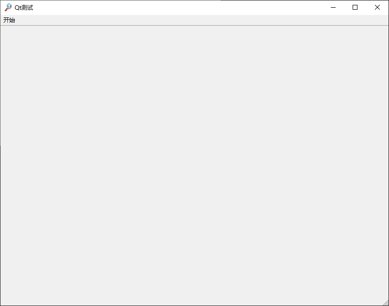
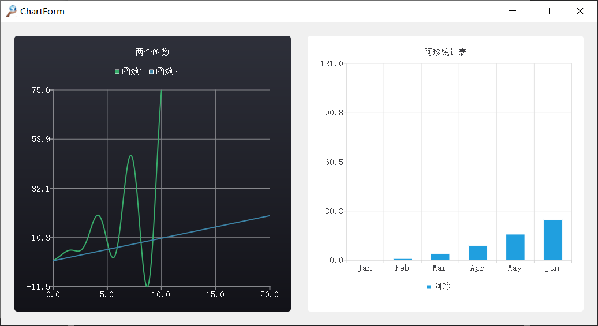
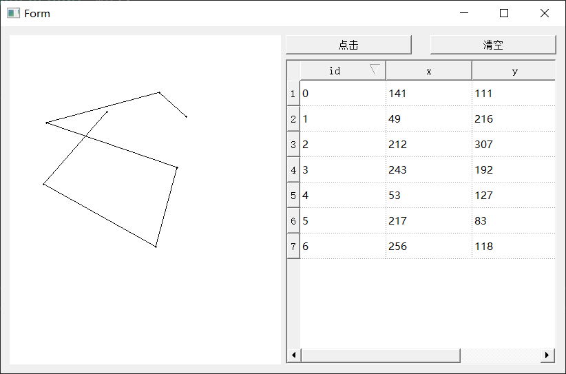
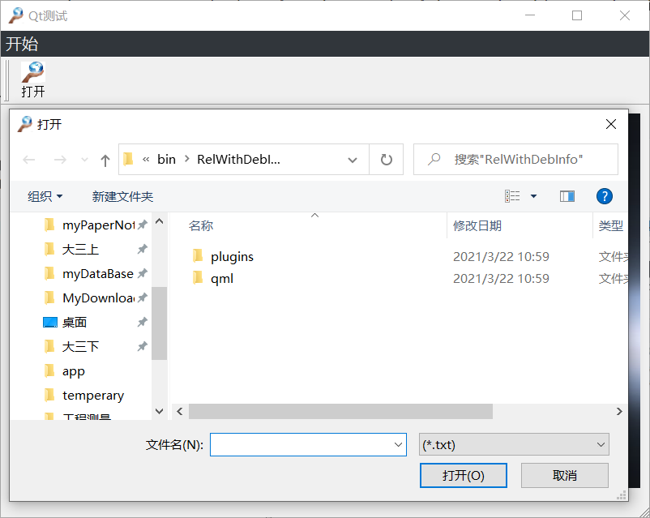

# 主窗口MainWindow

## main.cpp

```c++
#include<iostream>
#include "MainWindow.h"
#include<QApplication>
using namespace std;
int main(int argc, char *argv[])
{
	QApplication a(argc, argv);
	MainWindow w;
	w.show();
	return a.exec();
}
```

## MainWindow.h

```c++
#ifndef MAINWINDOW_H
#define MAINWINDOW_H
#include<QMainWindow>

QT_BEGIN_HEADER
namespace Ui { class MainWindow; }
QT_END_HEADER

class MainWindow :public QMainWindow
{
	Q_OBJECT
public:
	MainWindow(QWidget *parent = nullptr);
	~MainWindow();

public slots:

private:
	Ui::MainWindow *ui;
};
#endif MAINWINDOW_H
```

## MainWindow.cpp

```c++
#include "MainWindow.h"
#include "ui_MainWindow.h"
MainWindow::~MainWindow()
{
	delete ui;
}
MainWindow::MainWindow(QWidget *parent)
	:QMainWindow(parent)  //继承
	, ui(new Ui::MainWindow)  //在ui中，mainwindow继承了ui_mainwindow
{
	ui->setupUi(this);
}
```



# 绘制chart

首先在Qt designer 中绘制Widget 将其提升为 QChartView

用第一部分相同的方法构建ChartForm.h与ChartForm.cpp

**绘制折线图**

两种方法绘制

```c++
QSplineSeries *series = new QSplineSeries;
QLineSeries *series1 = new QSplineSeries;
QChart *chart = new QChart;
for (double i = 0; i < 10; i += 0.01) {
    series->append(i, qreal(cos(i)*sin(i)*pow(i, 2) + i * 3));
}
for (double i = 0; i < 20; i += 0.01) {
    *series1 << QPointF(i, i);   // 相对于里面的
}

series->setName(QString::fromLocal8Bit("函数1"));
series1->setName(QString::fromLocal8Bit("函数2"));
chart->addSeries(series);
chart->addSeries(series1);
chart->createDefaultAxes();
chart->setTheme(QChart::ChartThemeDark);
chart->setTitle(QString::fromLocal8Bit("两个函数"));
ui->LineChart1->setChart(chart);
ui->LineChart1->setRenderHint(QPainter::Antialiasing);
```

**绘制柱状图**

```c++
QBarSeries *series = new QBarSeries;
QBarCategoryAxis *axis=new QBarCategoryAxis();
QBarSet *set = new QBarSet(QString::fromLocal8Bit("阿珍"));
for (int i = 0; i < 12; i++) {
    *set << i * i;
}
series->append(set);
QChart *chart = new QChart();
chart->addSeries(series);
chart->setTitle(QString::fromLocal8Bit("阿珍统计表"));
chart->setAnimationOptions(QChart::SeriesAnimations);  //动画
QStringList categories;
categories << "Jan" << "Feb" << "Mar" << "Apr" << "May" << "Jun";
axis->append(categories);
chart->createDefaultAxes();
chart->setAxisX(axis, series);
chart->legend()->setVisible(true); //设置图例为显示状态
chart->legend()->setAlignment(Qt::AlignBottom);//设置图例的显示位置在底部

ui->LineChart1_2->setChart(chart);
ui->LineChart1_2->setRenderHint(QPainter::Antialiasing);
```



# 实时画图

可以不用设置ui，直接创建PaintWidget.h 与 PaintWidget.cpp

`PaintWidget.h`

```c++
#ifndef PAINTWIDGET_H
#define PAINTWIDGET_H
#include <QWidget>
#include<QMouseEvent>
#include<QPaintEvent>
#include<qdebug.h>
namespace Ui {
	class PaintWidget;
}
class PaintWidget : public QWidget
{
	Q_OBJECT
public:
	PaintWidget(QWidget *parent = nullptr);
	void mousePressEvent(QMouseEvent *);
	void paintEvent(QPaintEvent *event);
	void mouseMoveEvent(QMouseEvent *e);
	void mouseReleaseEvent(QMouseEvent *e);
	~PaintWidget();
	QVector<QPointF> pointList;
	QVector<QLineF> linefList;
public slots:
	void paintClean();
protected:
	bool bDraw;
	bool bLeftClick;
	bool bMove;
	QPointF movePoint;
private:
	Ui::PaintWidget *ui;
signals:
	void singalDrawOver();
};

#endif // PAINTWIDGET_H

```

`PaintWidget.cpp`

```c++
#include "PaintWidget.h"
#include<QPainter>
#include<iostream>
#include<qdebug.h>
using namespace std;
PaintWidget::PaintWidget(QWidget *parent) :
	QWidget(parent)
	
{
	//填充背景色
	setAutoFillBackground(true);
	setBackgroundRole(QPalette::Base);

	setMouseTracking(true);//打开鼠标追踪
}

PaintWidget::~PaintWidget()
{
	delete ui;
}

//当鼠标按下的时候将该点存到pointList
void PaintWidget::mousePressEvent(QMouseEvent *e) {
	pointList.push_back(QPointF(e->x(), e->y()));
}
//执行绘图事件
void PaintWidget::paintEvent(QPaintEvent * event)
{
	QPainter painter(this);
	int num = pointList.size();
	for (int i = 0; i < num; i++) {	
		painter.drawEllipse(QPoint(pointList[i].x(), pointList[i].y()), 1, 1);
	}
	if (num > 1) {
		for (int i = 0; i < num - 1; i++) {
			painter.drawLine(QPoint(pointList[i].x(), pointList[i].y()), QPoint(pointList[i + 1].x(), pointList[i + 1].y()));
		}
	}
}
//需要打开setMouseTracking
void PaintWidget::mouseMoveEvent(QMouseEvent * e){}
//当鼠标释放的时候更新paint事件
void PaintWidget::mouseReleaseEvent(QMouseEvent * e)
{
	update();
}
//清空图上点
void PaintWidget::paintClean() {
	pointList.clear();
	linefList.clear();
	update();
}

```

在写好后，设计一个ui文件，画一个widget，将它提升为PaintWidget类，并设计好大小和位置即可。

# 设计表格

```c++
#include<qstandarditemmodel.h>

//背景网格线设置
//显示
ui->tableView->setShowGrid(true);
ui->tableView->setGridStyle(Qt::DotLine);
ui->tableView->setSortingEnabled(true);

//表头
QStandardItemModel* model = new QStandardItemModel();
QStringList labels = QObject::trUtf8("id,x,y").simplified().split(",");//将string转为QStringList
model->setHorizontalHeaderLabels(labels);

//内容
QStandardItem *item = nullptr;
QPointF point;
for (int i = 0; i < ui->myPaintWidget->pointList.count(); i++) {
    item = new QStandardItem(QString("%1").arg(i));
    model->setItem(i, 0, item);
    point = ui->myPaintWidget->pointList[i];
    item = new QStandardItem(QString::number((ui->myPaintWidget->pointList[i].x())));//qreal转qstring统一用number方法
    model->setItem(i, 1, item);
    item = new QStandardItem(QString::number(ui->myPaintWidget->pointList[i].y()));
    model->setItem(i, 2, item);
}

ui->tableView->setModel(model);

```

### 综合

DrawList实现实时点击画图，当点击按钮时，会把点坐标显示到列表中



`DrawList.h`

```c++
#ifndef DRAWLIST_H
#define DRAWLIST_H
#include<QWidget>
#include "PaintWidget.h"
QT_BEGIN_HEADER
namespace Ui { class DrawList; }
QT_END_HEADER
class DrawList :public QWidget {
	Q_OBJECT
public:
	DrawList(QWidget *parent = nullptr);
	~DrawList();
public slots:
	void listShow();
	void paintClear();
private:
	Ui::DrawList *ui;
};
#endif DRAWLIST_H

```

`DrawList.cpp`

```c++
#include "DrawList.h"
#include<qstandarditemmodel.h>
#include "ui_DrawList.h"

DrawList::DrawList(QWidget *parent)
	:QWidget(parent)
	, ui(new Ui::DrawList)
{
	ui->setupUi(this);
	//背景网格线设置
	//显示
	ui->tableView->setShowGrid(true);
	ui->tableView->setGridStyle(Qt::DotLine);
	ui->tableView->setSortingEnabled(true);

	//表头
	QStandardItemModel* model = new QStandardItemModel();
	QStringList labels = QObject::trUtf8("id,x,y").simplified().split(",");
	model->setHorizontalHeaderLabels(labels);

	ui->tableView->setModel(model);

	connect(ui->btn, SIGNAL(clicked()), this, SLOT(listShow()));
	connect(ui->clear_btn, SIGNAL(clicked()),  SLOT(paintClear()));
}

void DrawList::paintClear() {
	ui->myPaintWidget->paintClean();
}

DrawList::~DrawList()
{
	delete ui;
}
void DrawList::listShow() {
	//表头
	QStandardItemModel* model = new QStandardItemModel();
	QStringList labels = QObject::trUtf8("id,x,y").simplified().split(",");
	model->setHorizontalHeaderLabels(labels);


	QStandardItem *item = nullptr;
	QPointF point;
	for (int i = 0; i < ui->myPaintWidget->pointList.count(); i++) {
		item = new QStandardItem(QString("%1").arg(i));
		model->setItem(i, 0, item);
		point = ui->myPaintWidget->pointList[i];
		item = new QStandardItem(QString::number((ui->myPaintWidget->pointList[i].x())));
		model->setItem(i, 1, item);
		item = new QStandardItem(QString::number(ui->myPaintWidget->pointList[i].y()));
		model->setItem(i, 2, item);
	}
	ui->tableView->setModel(model);
}

```

# 文件对话框



这里应用了工具条，在qtdesigner中添加toolbar，之后在cpp中直接创建各个qtoolbutton即可

```c++
{
	QToolButton *pActionOpenBar = new QToolButton(this);
	pActionOpenBar->setIcon(QIcon(":/sources/01.jpg"));
	pActionOpenBar->setToolButtonStyle(Qt::ToolButtonTextUnderIcon);
	pActionOpenBar->setText(QStringLiteral("打开"));
	ui->toolBar->addWidget(pActionOpenBar);
	connect(pActionOpenBar, SIGNAL(clicked()), SLOT(OpenFile()));
}
void MainWindow::OpenFile() {
	QString filename;
	filename = QFileDialog::getOpenFileName(this, QString::fromLocal8Bit("打开"), "", tr("(*.txt)"));
}
```

# QSS

主函数中加载qss文件

```c++
#include<QFile>

QFile qssFile(":style.qss");
qssFile.open(QFile::ReadOnly);
QString qss;
if (qssFile.isOpen())
{
    qss = QLatin1String(qssFile.readAll());
    qApp->setStyleSheet(qss);
    qssFile.close();
}
```


```css
QMenuBar {//Qt控件样式
    background-color: #31363b;
	font-size: 20px;
    color: #eff0f1;
}
#label{//objectname样式
	border-image:url(:images/ink.jpg);  //
}
.PaintWidget{//自定义类样式}
```

