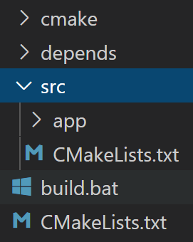

```bash
mkdir build
cd build
cmake -G "Visual Studio 15 2017" -A x64 -T host=x64 ^  		用64位编译器(TOOLCHAIN)编译64位程序
	-DCMAKE_PREFIX_PATH=%CONDA_PREFIX%/Library ^    		第三方库在哪里搜索
	-DCMAKE_TOOLCHAIN_FILE=%CONDA_PREFIX%/h2o.cmake ^      	toolchain文件  之前拷贝的h2o.cmake
															加的dll动态库会根据powershell脚本																				（applocal.ps1  qtdeploy.ps1）
															把当前的动态库所依赖的动态库找到后拷贝到当前文件夹下
	../
```


```bash
mkdir build
cd build
cmake -G "Visual Studio 15 2017" -A x64 -T host=x64 ^
	-DCMAKE_PREFIX_PATH=%CONDA_PREFIX%/Library ^
	-DCMAKE_TOOLCHAIN_FILE=%CONDA_PREFIX%/h2o.cmake ^
	../
```


#pragma 与ifdefine

## 项目架构



### `./CMakeLists.txt`

```cmake
cmake_minimum_required(VERSION 3.10)

project(MySPL LANGUAGES C CXX)

set(VERSION_MAJOR "0")
set(VERSION_MINOR "1")
set(VERSION_BUGFIX "0")
set(PROJECT_VERSION ${VERSION_MAJOR}.${VERSION_MINOR}.${VERSION_BUGFIX})

set(CMAKE_CXX_STANDARD 11)

set(CMAKE_RUNTIME_OUTPUT_DIRECTORY ${CMAKE_CURRENT_BINARY_DIR}/bin)
set(CMAKE_LIBRARY_OUTPUT_DIRECTORY ${CMAKE_CURRENT_BINARY_DIR}/lib)
set(CMAKE_ARCHIVE_OUTPUT_DIRECTORY ${CMAKE_CURRENT_BINARY_DIR}/lib)
set(CMAKE_MODULE_PATH "${CMAKE_MODULE_PATH};${CMAKE_CURRENT_SOURCE_DIR}/cmake")

###  CMAKE_CURRENT_BINARY_DIR  当前正在处理的二进制目录路径   对于此处是在build文件夹下创建
###  CMAKE_CURRENT_SOURCE_DIR  当前处理的CMakeLists.txt所在的目录  MySPL

###以下为qt所用
set(CMAKE_AUTOMOC ON)
set(CMAKE_AUTORCC ON)
set(CMAKE_AUTOUIC ON)

set(CMAKE_WINDOWS_EXPORT_ALL_SYMBOLS ON)

option(BUILD_SHARED_LIBS "Build Dynamic Libs" ON)


if(MSVC)
    add_compile_definitions("/utf-8")    
endif(MSVC)


find_package(Eigen3 REQUIRED)

find_package(Laszip REQUIRED)
## eigen库比较特殊，在include中直接提供源码，所以在找到eigen后，直接include其路径即可
## 编译的ranger静态库，需要通过
## CMAKE_CURRENT_LIST_DIR  当前正在处理的列表文件的完整目录
include_directories(${EIGEN3_INCLUDE_DIR} ${CMAKE_CURRENT_LIST_DIR}/depends)


find_package(Qt5 COMPONENTS Core Gui Widgets REQUIRED)

include_directories(${CMAKE_CURRENT_LIST_DIR}/src)   
add_subdirectory(src)
```

### `./src/CMakeLists.txt`

```cmake
include_directories(${CMAKE_CURRENT_LIST_DIR})

add_subdirectory(app)
```

### `./src/app/CMakeLists.txt`

```cmake
file(GLOB SOURCES "*.h" "*.cpp" "*.hpp" "*.ui" "*.qrc")

add_executable(app ${SOURCES})

include_directories(${CMAKE_CURRENT_LIST_DIR})           #将当前目录添加到include中
target_link_libraries(app PUBLIC Laszip::Laszip ranger)  #链接静态库
```

### `./depends/CMakeLists.txt`

```cmake
include_directories(${CMAKE_CURRENT_LIST_DIR})

add_subdirectory(ranger)

```

`./src/mymath`

```cmake
file(GLOB SOURCES "*.h" "*.cpp" "*.hpp" "*.ui" "*.qrc")

#add_executable(app ${SOURCES})
add_library(mymath STATIC ${SOURCES})
include_directories(${CMAKE_CURRENT_LIST_DIR})           #将当前目录添加到include中
```


## CMAKE基础知识

[简单的语法与常用命令](https://blog.csdn.net/dbzhang800/article/details/6329068?utm_medium=distribute.pc_relevant.none-task-blog-BlogCommendFromMachineLearnPai2-1.control&depth_1-utm_source=distribute.pc_relevant.none-task-blog-BlogCommendFromMachineLearnPai2-1.control)

### find_package

[CMake如何查找链接库---find_package的使用方法](https://blog.csdn.net/u011092188/article/details/61425924?utm_source=blogxgwz0)

[CMake如何查找库路径](https://blog.csdn.net/ybh491707054/article/details/55003313?utm_medium=distribute.pc_relevant.none-task-blog-BlogCommendFromMachineLearnPai2-2.control&depth_1-utm_source=distribute.pc_relevant.none-task-blog-BlogCommendFromMachineLearnPai2-2.control)

[cmake教程4(find_package使用)](https://blog.csdn.net/haluoluo211/article/details/80559341?utm_medium=distribute.pc_relevant.none-task-blog-BlogCommendFromMachineLearnPai2-3.control&depth_1-utm_source=distribute.pc_relevant.none-task-blog-BlogCommendFromMachineLearnPai2-3.control)

[CMakeLists.txt中常用库文件的查找和链接](https://zhuanlan.zhihu.com/p/73373016)

