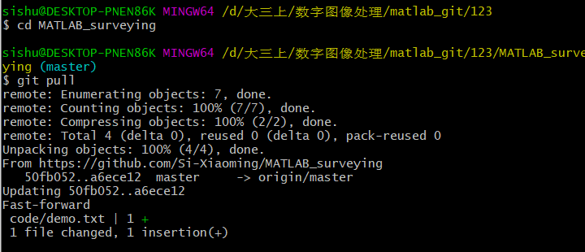
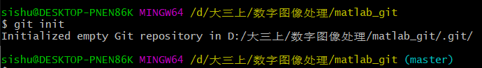

# git学习

## 直接从github上下载

1. 下载  clone即可下载成功

   ```
   git clone https://github.com/Si-Xiaoming/MATLAB_surveying
   ```

2. 更新  

   ```
   cd MATLAB_surveying   切换到仓库文件夹
   git pull              pull更新
   ```

   


## 在文件夹里创建本地库

1. 在文件夹里初始化.git文件

   

   

2. 添加到本地库

   ```
   /****重要执行的****/
   //提交分两步
   git add readme.md   //添加文件到暂存区
   git commit -m "readme.md提交"  //把文件提交到仓库。-m后面是注释
   /****--------****/
   
   git status      //查看状态，如果有改变，可通过diff查看更改的地方
   git diff readme.md
   
   ```

   

3. [如何用git上传代码到github详细步骤](https://blog.csdn.net/zeng092210/article/details/95622318)

4. [常见问题](https://blog.csdn.net/Wbiokr/article/details/73431199)

