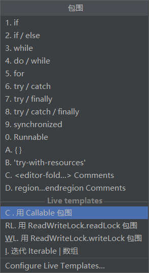
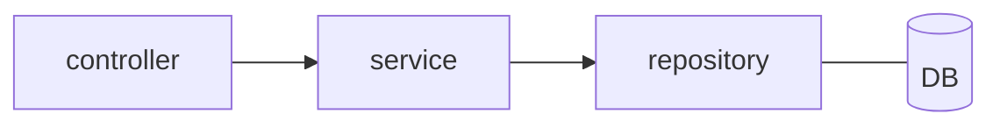
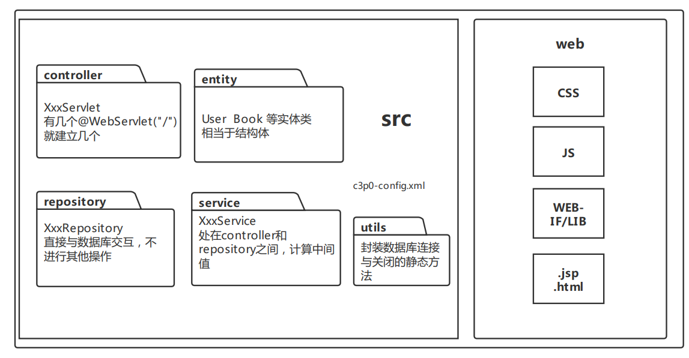

## IDEA

### 快捷键使用

1、在java类中添加geter setter 方法，以及构造函数：   Alt+insert

2、在函数前面输入            /**   +enter

```java
    /**
     * 
     * @param index
     * @param limit
     * @return
     */
```

3、快速添加try-catch      Ctrl+alt+t     【ps：必须提前把idea的大小写敏感关掉】



4、代码对齐、格式化：选中--->代码--->重新格式化代码

## Servlet

```
1、request：表示⼀次请求，HttpServletRequest。
2、response：表示⼀次响应，HttpServletResponse。
3、pageContext：⻚⾯上下⽂，获取⻚⾯信息，PageContext。
4、session：表示⼀次会话，保存⽤户信息，HttpSession。
5、application：表示当前 Web 应⽤，全局对象，保存所有⽤户共享信息，ServletContext。
6、config：当前 JSP 对应的 Servlet 的 ServletConfig 对象，获取当前 Servlet 的信息。
7、out：向浏览器输出数据，JspWriter。
8、page：当前 JSP 对应的 Servlet 对象，Servlet。
9、exception：表示 JSP ⻚⾯发⽣的异常，Exception。
```

常⽤的是 request、response、session、application、pageContext

### request

```
1、String getParameter(String key) 获取客户端传来的参数。
2、void setAttribute(String key,Object value) 通过键值对的形式保存数据。
3、Object getAttribute(String key) 通过 key 取出 value。
4、RequestDispatcher getRequestDispatcher(String path) 返回⼀个 RequestDispatcher 对象，该对象的 forward ⽅法⽤于请求转发。
5、String[] getParameterValues() 获取客户端传来的多个同名参数。
6、void setCharacterEncoding(String charset) 指定每个请求的编码。
```

<font color=red size=4>注意getParameter与getAttribute的区别：</font>

​	getParameter是从客户端提取参数；而getAttribute是从服务器端提取参数。

**此外，如果set/getAttribute是跨请求的，则保存在session中**

==乱码问题==

​	还有一个重要的地方：如果输入的请求中有中文，必须在第一行设置req.setCharacterEncoding("UTF-8");不然会乱码！

### response

```
1、sendRedirect(String path) 重定向，⻚⾯之间的跳转。
转发 getRequestDispatcher 和重定向 sendRedirect 的区别：
转发是将同⼀个请求传给下⼀个⻚⾯，重定向是创建⼀个新的请求传给下⼀个页面，之前的请求结束生命周期。
转发：同⼀个请求在服务器之间传递，地址栏不变，也叫服务器跳转。
重定向：由客户端发送⼀次新的请求来访问跳转后的⽬标资源，地址栏改变，也叫客户端跳转。
如果两个⻚⾯之间需要通过 request 来传值，则必须使⽤转发，不能使⽤重定向。
⽤户登录，如果⽤户名和密码正确，则跳转到⾸⻚（转发），并且展示⽤户名，否则重新回到登陆页面
（重定向）。
```

|                          转发                           |                            重定向                            |
| :-----------------------------------------------------: | :----------------------------------------------------------: |
|                req.getRequestDispatcher                 |                       resp.senRedirect                       |
|               将同⼀个请求传给下⼀个页面                |    创建⼀个新的请求传给下⼀个页面，之前的请求结束生命周期    |
|         同⼀个请求在服务器之间传递，地址栏不变          |  由客户端发送⼀次新的请求来访问跳转后的⽬标资源，地址栏改变  |
| 如果两个⻚⾯之间需要通过 request 来传值，则必须使⽤转发 | ⽤户登录，如果⽤户名和密码正确，则跳转到⾸⻚（转发），并且展示⽤户名，否则重新回到登陆⻚⾯（重定向）。 |

## Session

常用方法：

```
String getId() 获取 sessionID
void setMaxInactiveInterval(int interval) 设置 session 的失效时间，单位为秒
int getMaxInactiveInterval() 获取当前 session 的失效时间
void invalidate() 设置 session ⽴即失效
void setAttribute(String key,Object value) 通过键值对的形式来存储数据
Object getAttribute(String key) 通过键获取对应的数据
void removeAttribute(String key) 通过键删除对应的数据
```

操作：

```java
//存入session
HttpSession session = req.getSession();
session.setAttribute("reader",reader);
//取出session
HttpSession session = req.getSession();
Reader reader = (Reader)session.getAttribute("reader");
```

session：保存在服务器     保存的数据是 Object     会随着会话的结束而销毁     保存重要信息

生命周期：服务端：只要 WEB 应⽤重启就销毁，客户端：只要浏览器关闭就销毁。

## EL & JSTL

### EL表达式

前提是⼀定要先 setAttribute， EL 就相当于在简化 getAttribute;

```jsp
<%
	User user = new User(1,"张三",86.5,new Address(1,"小寨"));
	pageContext.setAttribute("user",user);
%>
<table>
    <tr>
        <th>编号</th>
        <th>姓名</th>
        <th>成绩</th>
        <th>地址</th>
    </tr>
    <tr>
        <td>${user.id}</td>
        <td>${user.name}</td>
        <td>${user.score}</td>
        <td>${user.address}</td>
    </tr>
</table>
```

```
${num1&&num2}
&& || ! < > <= <= ==
&& and
|| or
! not
== eq
!= ne
< lt
> gt
<= le
>= ge
empty 变量为 null，⻓度为0的String，size为0的集合
```

### JSTL表达式

首先导入包：

1、需要导⼊ jar 包（两个 jstl.jar standard.jar）存放的位置 web/WEB-INF

 2、在 JSP ⻚⾯开始的地⽅导⼊ JSTL 标签库

```jsp
<%@ taglib prefix="c" uri="http://java.sun.com/jsp/jstl/core" %>
```

3、在需要的地⽅使⽤

```jsp
<c:forEach items="${list}" var="user">   	<!--list是传回来的集合，用user遍历-->
 <tr>
 <td>${user.id}</td>
 <td>${user.name}</td>
 <td>${user.score}</td>
 <td>${user.address.value}</td>
 </tr>
</c:forEach>
```

核心标签库常用标签： 

- set、out、remove、catch

  set：向域对象中添加数据

  ```jsp
  <%
   requset.setAttribute(key,value)
  %>
  <c:set var="name" value="tom" scope="request"></c:set>
  ${requestScope.name}
  <%
  User user = new User(1,"张三",66.6,new Address(1,"科技路"));
  request.setAttribute("user",user);
  %>
  ${user.name}
  <hr/>
  <c:set target="${user}" property="name" value="李四"></c:set>
  ${user.name}
  ```

  out：输出域对象中的数据

  ```jsp
  <c:set var="name" value="tom"></c:set>
  <c:out value="${name}" default="未定义"></c:out>
  ```

  remove：删除域对象中的数据

  ```jsp
  <c:remove var="name" scope="page"></c:remove>
  <c:out value="${name}" default="未定义"></c:out>
  ```

  catch：捕获异常

  ```jsp
  <c:catch var="error">
   <%
   int a = 10/0;
   %>
  </c:catch>
  ${error}
  ```

- 条件标签：if choose

  ```jsp
  <c:set var="num1" value="1"></c:set>
  <c:set var="num2" value="2"></c:set>
  <c:if test="${num1>num2}">ok</c:if>
  <c:if test="${num1<num2}">fail</c:if>
  <hr/>
  <c:choose>
   <c:when test="${num1>num2}">ok</c:when>
   <c:otherwise>fail</c:otherwise>
  </c:choose>
  ```

- 迭代标签：forEach

  ```jsp
  <c:forEach items="${list}" var="str" begin="2" end="6" step="2"
  varStatus="sta">
   ${sta.count}、${str}<br/>
  </c:forEach>
  ```

## AJAX


## JDBC

此处我们直接用JDBC连接池

JDBC 的数据库连接池使⽤ javax.sql.DataSource 接⼝来完成的，DataSource 是 Java 官⽅提供的接 ⼝，使⽤的时候开发者并不需要⾃⼰来实现该接⼝，可以使⽤第三⽅的⼯具，C3P0 是⼀个常⽤的第三 ⽅实现，实际开发中直接使⽤ C3P0 即可完成数据库连接池的操作。

步骤：

1、把c3p0-xxx.jar 放到web-inf/lib下；

2、在src目录下创建一个c3p0-config.xml

```xml
<?xml version="1.0" encoding="UTF-8"?>
<c3p0-config>
     <named-config name="testc3p0">
         <!-- 指定连接数据源的基本属性 -->
         <property name="user">root</property>
         <property name="password">root</property>
         <property name="driverClass">com.mysql.jdbc.Driver</property>
         <property name="jdbcUrl">jdbc:mysql://localhost:3306/library?
        useUnicode=true&amp;characterEncoding=UTF-8</property>
         <!-- 若数据库中连接数不⾜时, ⼀次向数据库服务器申请多少个连接 -->
         <property name="acquireIncrement">5</property>
         <!-- 初始化数据库连接池时连接的数量 -->
         <property name="initialPoolSize">20</property>
         <!-- 数据库连接池中的最⼩的数据库连接数 -->
         <property name="minPoolSize">2</property>
         <!-- 数据库连接池中的最⼤的数据库连接数 -->
         <property name="maxPoolSize">40</property>
     </named-config>
</c3p0-config>
```

详细操作在MVC中

## MVC

是一种开发模式，将程序分层的一种思想。

| M                                     | V                          | C                              |
| ------------------------------------- | -------------------------- | ------------------------------ |
| Model                                 | View                       | Controaller                    |
| 业务数据（service repository entity） | 视图（jsp html app客户端） | 控制（servlet handler action） |

请求进入Java web应用后，controller接收该请求，进行业务逻辑处理，最终将处理的结果再返回给用户（view+model）

entity:

controller(业务请求)  ->service（是登录还是注册还是退出）->repository(连接数据库)[一个表对应一个repository]



### 项目结构



### utils层

这一层较为固定

```java
public class JDBCTools {
    private static DataSource dataSource;
    static{
        dataSource = new ComboPooledDataSource("testc3p0");  //加载连接池中的配置
    }
    public static Connection getconnection(){
        Connection connection = null;
        try {
            connection = dataSource.getConnection();
        } catch (SQLException e) {
            e.printStackTrace();
        }
        return connection;
    }
    public static void release(Connection connection, Statement statement, ResultSet resultSet){
        try {
            if(connection !=null){
                connection.close();
            }
            if(statement !=null){
                statement.close();
            }
            if(resultSet !=null){
                resultSet.close();
            }
        } catch (SQLException e) {
            e.printStackTrace();
        }
    }
}
```

### repository层

- 对数据库增删查改

```java
public List<Book> findAll(int index,int limit) {
    //step1：连接数据库
    Connection connection = JDBCTools.getconnection();
    String sql = "SELECT * FROM book,bookcase where book.bookCase =bookcase.id limit ?,?";   
    //step2：初始化参数
    PreparedStatement preparedStatement = null;
    ResultSet resultSet = null;
    List<Book> list =new ArrayList<>();
    try {
        //step3：把sql语言传入
        preparedStatement = connection.prepareStatement(sql);
        preparedStatement.setInt(1,index);
        preparedStatement.setInt(2,limit);
        //step4：把查询结果传到内存
        resultSet = preparedStatement.executeQuery();
        while (resultSet.next()){
            list.add(new Book(resultSet.getInt(1),resultSet.getString(2),resultSet.getString(3)
                              ,new BookCase(resultSet.getInt(5),resultSet.getString(6))));
        }
    } catch (SQLException e) {
        e.printStackTrace();
    }
    return list;
}
```

- 统计个数

```java
public int count() {
    Connection connection = JDBCTools.getconnection();
    String sql = "SELECT count(*) FROM book,bookcase where book.bookCase =bookcase.id ";
    PreparedStatement preparedStatement = null;
    ResultSet resultSet = null;
    int count = 0;
    try {
        preparedStatement = connection.prepareStatement(sql);
        resultSet = preparedStatement.executeQuery();
        while (resultSet.next()){
            count = resultSet.getInt(1);
        }
    } catch (SQLException e) {
        e.printStackTrace();
    }
    return count;
}
```

### service层

比较灵活，将controller与repository连接

示例为视频中的例子：分页展示数据

```java
public class BookServiceImpl implements BookService {
    private BookRepository bookRepository = new BookRepositoryImpl();
    private BorrowRepository borrowRepository = new BorrowRepositoryImpl();
    private final Integer LIMIT = 6;//常量
    @Override
    public List<Book> findAll(int page) {
        int index = (page-1)*LIMIT;
        return bookRepository.findAll(index,LIMIT);
    }
    @Override
    public int getPages() {
        int count = bookRepository.count();
        int page = 0;
        if(count % LIMIT == 0){
            page = count/LIMIT;
        }else{
            page = count/LIMIT+1;
        }
        return page;
    }
```

### controller层

```java
public class BookServlet extends HttpServlet {
    protected void doGet(HttpServletRequest req, HttpServletResponse resp) throws ServletException, IOException {
        String pageStr = req.getParameter("page");
        Integer page = Integer.parseInt(pageStr);
        List<Book> list = bookService.findAll(page);
        req.setAttribute("list",list);
        req.setAttribute("dataPrePage",6);
        req.setAttribute("currentPage",page);
        req.setAttribute("pages",bookService.getPages());
        req.getRequestDispatcher("index.jsp").forward(req,resp);
    }
}
```


[java String 转Json报错](https://blog.csdn.net/u010328311/article/details/58026364)

> commons-beanutils-1.7.0.jar
>
> commons-collections-3.2.jar
>
> commons-lang-2.4.jar
>
> commons-logging-1.1.jar
>
> ezmorph-1.0.4.jar
>
> json-lib-2.2.2-jdk15.jar

[java周数与相应时间转换实体类](https://blog.csdn.net/qq_36637705/article/details/81129090)

