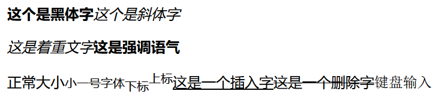
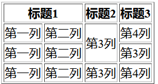
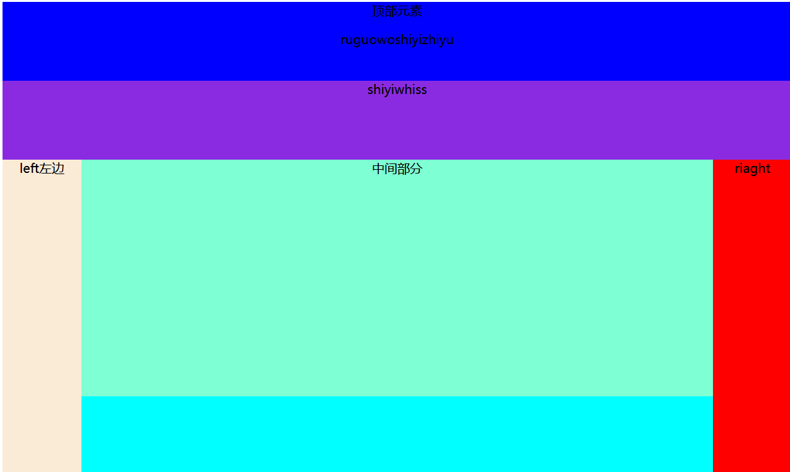
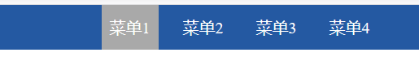

# 前端

## HTML

  ### 标签

```html
<h> <p> <br>   id
<a>            id  href   target
<div>          id
<input type=" ">
    text	password	radio	checkbox	file	email	button(按钮)	submit	reset
<textarea></textarea>    多行文本
select   option
form	要提交的内容放置在form
    -action    响应之后数据传到哪里
    -method
    -enctype   上传文件
<ul>
<table>
<iframe>  <fieldset>
```

### 其他标签

```html
<hr>  <!--分隔内容-->
<p><b>这个是黑体字</b><i>这个是斜体字</i></p>
<p><em>这是着重文字</em><strong>这是强调语气</strong></p>
<p>正常大小<small>小一号字体</small>  
 <sub>下标</sub><sup>上标</sup>
 <ins>这是一个插入字</ins>  <del>这是一个删除字</del>  <kbd>键盘输入</kbd> </p>

<p><code>int a = 0;</code></p>

<center>这个文本居中对齐。</center>
```



**table**

```html
<table style="text-align: center;border: 1;" border="1" cellpadding="2" cellspacing="0" align="center">
    <tr>
        <th>姓名</th>
        <th>学号</th>
    </tr>
    <tr>
        <td>张三</td>
        <td>2018114777</td>
    </tr>
    <tr>
        <td>李四</td>
        <td>2014754542</td>
    </tr>
</table>
```

其中，align让整个表居中

**合并单元格**



```html
<table border="1">
    <thead>
    <tr>  <!--行-->
        <th colspan="2">标题1</th>    <!--合并单元格-->
        <th>标题2</th>
        <th>标题3</th>
    </tr>
    </thead>
    <tbody>
    <tr>
        <td>第一列</td>
        <td>第二列</td>
        <td rowspan="2">第3列</td>
        <td>第4列</td>
    </tr>
    <tr>
        <td>第一列</td>
        <td>第二列</td>
        <td>第3列</td>
    </tr>
    <tr>
        <td>第一列</td>
        <td>第二列</td>
        <td>第3列</td>
        <td>第4列</td>
    </tr>
    </tbody>
</table>
```


## CSS

**存放位置**

1. 单独CSS文件

   ```css
   div{
   	background-color:red;
   	color:white;
   }
   在HTML文件里：
   ```

   ```html
   <title>CSS</title>
   <link rel="stylesheet" href="CSSCommon.css">
   ```

   

2. HTML head里面用 

   ```html
   <style>
       div{
           background-color:red;
           color:white;
       }
       	
   </style>
   ```

3. 标签属性  style

   ```html
   <h1 style="background-color:cyan;font-family:fantasy;color:crimson;text-align: center;">标题</h1>
   ```

   text-align能够让文本居中

   **优先级**
   
   标签>头部>CSS文件

### 整体布局初探



其中.pg-body .body-content 里的内容多的话可以出现滚轮，但其他部分不产生影响

```html
<html>
    <head>
        <meta charset="utf-8">
        <title>DIVDEMO布局</title>
        <style type="text/css">
            #container{
                background-color:aqua;
                width: 1000px;
                height: 600px;
            }
            #top{
				background-color: blue;
				width: 1000px;
				height: 100px;
			}
			#bottom{
				background-color:blueviolet;
				width: 1000px;
				height: 100px;
                float:inline-end
			}
			#left{
				background-color: antiquewhite;
				width: 100px;
				height: 400px;
				float: left;/*漂浮属性,让块状元素不换行*/
			}
			#main{
				background-color: aquamarine;
				width: 800px;
				height: 400px;
			}
			#right{
				background-color: #FF0000;
				width: 100px;
				height: 400px;
				float: right;
			}
            .pg-body .body-content{
            position: absolute;
            top: 44px;
            left: 200px;
            bottom: 0;
            right:  0;
            background-color: green;
            margin: 0;
            overflow: auto;       /*内容出了区域之后会有滚动条*/
        }
        </style>
    </head>
    <body>
        <center>
            <div id="container">
                <div id="top">
                    <p>顶部元素</p>
                    <p>ruguowoshiyizhiyu</p>
                </div>
                <div id="bottom">shiyiwhiss</div>
                <div id="right">riaght</div>
                <div id="left">left左边</div>
                <div id="main">中间部分</div>
            </div>
        </center>
    </body>
</html>
```

### CSS选择器

```css
#i1{ }  id选择器
.c1{ background-color: red;}   /*标签选择器  class="c1"*/
 /*层级选择器   很常用*/
.c2 div p a{color:darkmagenta;}
/*组合选择器   很常用*/
.c4,.c5,.c6{background-color: aqua;}
```


### 效果

```
display:none     这一部分没了  应用很广
		inline   变为内联标签（span）
		block	 变为块级标签
		inline-block 既有内联又有块级标签属性  span可以调整大小了
```

注：纯内联标签无法设置长宽

### 边距

```
margin   外边距	本身不增加
padding	 内边距	本身增加
```

### 漂浮

```html
float: left   right
如果加边框
需要在本div后面加一句
<div style="width:500px ;border:solid red">
    <div style="width:20% ;background-color: red ;float:left">f20</div>
    <div style="width:80%;background-color: orange;float:left">f80</div>
    <div style="width:20% ;background-color: red ;float:left">f20</div>
    <div style="width:30%;background-color: orange;float:right">f80</div>
    <div style="width:50%;background-color: orange;float:right">f8011</div>
    <div style="clear: both"></div>   <!--把父级边界加回来-->
</div>
```

### position

```
relative		单独的时候没效果，要与absolute结合
absolute		固定 滚动会移动	
fixed			固定（相对于浏览器的窗口 如：返回顶端操作）
relative + absolute  
```

#### 实例：

第一个`返回`是在某一个div的右下角（bottom: 0;right:0）；

第二个`返回顶部`是永远在当前界面右下角（bottom:0px;right: 100px）

```html
<div style="height: 1000px;background-color: chartreuse;position: relative">
    <div style="position:absolute;bottom: 0;right:0;">返回</div>
</div>
<h2>fixed</h2>
<div style="position:fixed;bottom:0px;right: 100px;font-size: 100px">返回顶部</div>
```


### 制作首页抬头部分



```css
<style>
    body{
        margin: 0;    /*整个页面与边界间没有空隙*/
    }
    .pg-header{
        height:44px;
        background-color: #2459a2;
        line-height: 44px;     /*整个高度为44，在这里面居中*/
    }
    .w{
        width:380px;
        margin: 0 auto;      /*居中    比较好用*/
        background-color: red;
    }
    ul{
        margin: 0;
        list-style-type: none;
    }
    ul li{
        float: left;
        padding: 0 8px 0 8px;   /*上 右 下 左*/
        margin:0 8px 0 8px;
        color: white;
        cursor: pointer;
    }
    ul li:hover{
        background-color:darkgray;      /*当鼠标移动到上面时会有什么变化*/
    }
</style>
```

```html
<div class="pg-header">
    <div class="w">
        <ul>
            <li>菜单1</li>
            <li>菜单2</li>
            <li>菜单3</li>
            <li>菜单4</li>
        </ul>
    </div>
</div>
<div class="pg-body"></div>
<div class="pg-footer"></div>
```


## JavaScript

```javascript
1.一定在body内部最下面引用。
2.变量：
	var a = 123;  局部变量
    a = 123;	  全局变量
```

### 类型转换

```javascript
转换：
	parserInt(a);   //将某值转换为数字，不成功则为NaN;
	parseFloat(a);	//将某值转换为浮点数，否则为NaN;
特殊值：
	NaN  		非数字 可用  isNaN(num) 判断
    Infinity 	无穷大 可用  isFinite(num)判断
```

```javascript
var status = true;
var status = false;
/*
在js中进行比较时，需要注意：
    ==       比较值相等
    !=       不等于
    ===      比较值和类型相等
    !===     不等于
    ||        或
    &&        且
*/
```


### 字符串

```javascript
var name = "wupeiqi";
var value = names[0]                    // 索引
var value = name.length                 // 获取字符串长度
var value = name.trim()                 // 去除空白
var value = name.charAt(index)          // 根据索引获取字符
var value = name.lastIndexOf()
var value = name.substring(start,end)   // 根据索引获取子序列
var value = name.split("i",name)
```

### 数组

```javascript
// 常见方法
var names = ['武沛齐', '肖峰', '于超']
names[0]                        // 索引
names.push(ele)                 // 尾部追加元素
var ele = names.obj.pop()       // 尾部移除一个元素
names.unshift(ele)              // 头部插入元素
var ele = obj.shift()           // 头部移除一个元素
names.splice(index,0,ele)       // 在指定索引位置插入元素    //非常好用！！！！！！！！
names.splice(index,1,ele)       // 指定索引位置替换元素      //非常好用！！！！！！！！   可以用于删除某个值
names.splice(index,1)           // 指定位置删除元素
names.slice(start,end)          // 切片
names.reverse()                 // 原数组反转
names.join(sep)                 // 将数组元素连接起来以构建一个字符串
names.concat(val,..)            // 连接数组
names.sort()                    // 对原数组进行排序
```

```
对于join：
python：
	a=["a","s"]
	"_".join(a)
JS:
	a=["a","s"];
	a.join("_");
```

### 字典与json 序列化

```javascript
//json->string
var info = {name:'alex',age:19,girls:['钢弹','铁锤']}
var infoStr = JSON.stringify(info)
```

结果："{"name":"alex","age":19,"girls":["钢弹","铁锤"]}"

```javascript
//string->json
var infoStr = '{"name":"alex","age":19,"girls":["钢弹","铁锤"]}'
var info = JSON.parse(infoStr)
```

结果："name":"alex","age":19,"girls":["钢弹","铁锤"]

### eval

```javascript
相当于eval+exec
eval("alert(123)")
```

### 时间处理

```javascript
d=new Date();
d.getHours();
d.getFullYear();
d.getUTCHours();
d.setMinutes(15);  //设置分钟是15分钟
```

### 语句

#### 条件

```javascript
var age = 18;
if(age <18){
}else if(age>=18 and 1 == 1){
}else if(age>=30){
}else{
}

var num = 18;
switch(num){
    case 10:
        console.log('未成年');
        break;
    case 18:
        console.log('成年');
        break;
    default:
        console.log('太大了');
}
```

#### 循环

```javascript
var names = ['武沛齐', '肖峰', '于超']
for(var index in names){
    console.log(index, names[index])
}

var names = ['武沛齐', '肖峰', '于超']
for(var i=0;i<names.lenght;i++){
    console.log(i, names[i])
}

var dic ={"k1":112,"k2":222};
for(var i in dic)
{
    console.log(dic[i]);
}
```

#### 异常处理

```javascript
try {
    //这段代码从上往下运行，其中任何一个语句抛出异常该代码块就结束运行
    var name = ''
}
catch (e) {
    // 如果try代码块中抛出了异常，catch代码块中的代码就会被执行。
    //e是一个局部变量，用来指向Error对象或者其他抛出的对象
}
finally {
     //无论try中代码是否有异常抛出（甚至是try代码块中有return语句），finally代码块中始终会被执行。
}

//*********OR********//
throw new Error("错误！");
```

### 函数

1. 一般函数

   ```javascript
   function func(arg){
       return arg + 1;
   }
   ```

2. 匿名函数

   ```javascript
   setInterval(function(){alert("123456789");},1000);
   ```

   

3. 自执行函数

   ```javascript
   (function(arg){alert(arg);})(123);
   ```

   自执行函数可以封装


JS没有块级作用域；是以函数为作用域；有作用域链；   作用域链在执行之前已经创建

### 制作滚动横幅

```html
<body>
    <div id="i1" style="display: inline-block;background-color: green;color: white">欢迎领导莅临指导</div>
    <script>
        setInterval("f1()",1000)  //每一秒中执行一次f1函数
        function f1() {
            //获取某一标签
            var tag=document.getElementById('i1');
            //获取标签内容
            var text =tag.innerText;
            var a=text.charAt(0);
            var sub=text.substring(1,text.length);
            var new_str=sub+a;
            tag.innerText=new_str;
        }
    </script>
</body>
```

### 制作动态提示输入框

```html
<body>
<input id="i1" type="text" value="请输入关键字" onfocus="Focus();" onblur="Blur()">
<script>
    function Focus(){
        var tag = document.getElementById("i1");
        if(tag.value=="请输入关键字"){
            tag.value="";
        }
    }
    function Blur() {
        var tag = document.getElementById("i1");
        var tagvalue = tag.value;
        if(tagvalue.trim().length==0){
            tag.value="请输入关键字";
        }
    }
</script>
</body>
```

### 制作模态对话框

```html
<head>
    <meta charset="UTF-8">
    <title>对话框</title>
    <style>
        .hide{
            display: none !important;
        }
        .modal{
            width:400px;
            height: 300px;
            background-color: aquamarine;
            position: fixed;
            top: 50%;
            left: 50%;
            margin-left: -200px;
            margin-top: -150px;
            z-index: 10;   /*优先级*/
        }
        .shadow{
            position:fixed;
            background-color: black;
            top:0;
            bottom: 0;
            right: 0;
            left: 0;
            opacity: 0.6;    /*透明度*/
            z-index: 8;
        }
    </style>
</head>
<body>
    <div><input type="button" value="添加" onclick="showmodal()"></div>
    <div id="shade" class="shadow hide"></div>
    <div id="modal" class="modal hide">对话框 <br>
        <input />
        <input />
        <input />
        <input />
        <a href="javascript:void(0)" onclick="hidemodal();">返回</a>
    </div>

<script>
    function showmodal() {
        var t1 =document.getElementById('shade');
        var t2 =document.getElementById('modal');
        t1.classList.remove("hide");
        t2.classList.remove("hide");
    }
    function hidemodal() {
        var t1 =document.getElementById('shade');
        var t2 =document.getElementById('modal');
        t1.classList.add("hide");
        t2.classList.add("hide");
    }
</script>
</body>
```


## DOM

  ### 查找

 直接查找

```javascript
document.getElementById(arg)             // 根据ID获取一个标签对象
document.getElementsByClassName(arg)     // 根据class属性获取标签对象集合
document.getElementsByName(arg)       // 根据name属性值获取标签对象集合
document.getElementsByTagName(arg)       // 根据标签名获取标签对象集合
```

 间接查找

```javascript
var tag = document.getElementById(arg);
tag.parentElement           // 找当前标签对象的父标签对象
tag.children                // 找当前标签对象的所有子标签对象
tag.firstElementChild       // 找当前标签对象的第一个子标签对象
tag.lastElementChild        // 找当前标签对象最后一个子标签对象
tag.nextElementtSibling     // 找当前标签对象下一个兄弟标签对象
tag.previousElementSibling  // 找当前标签对象上一个兄弟标签对象
```


### 操作

```javascript
var tag = document.getElementById(arg);
var text = tag.innerText(tag);
value
innerHtml
class:
    className
    classList.add/.remove
样式：
tag=.....
tag.style.color = "red";
```

